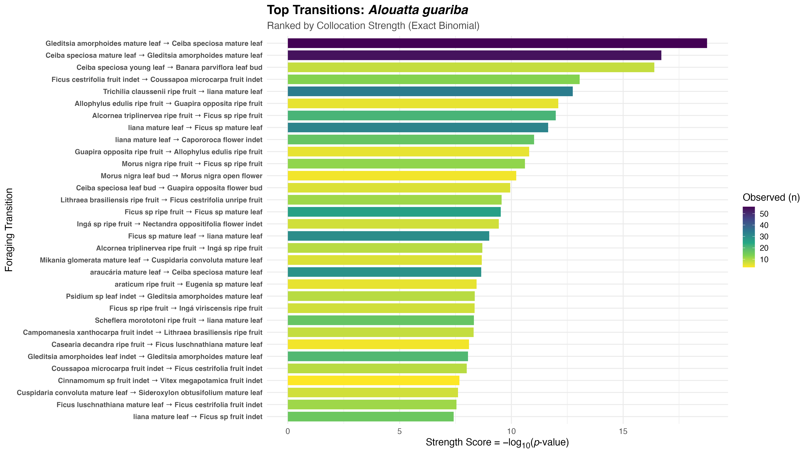
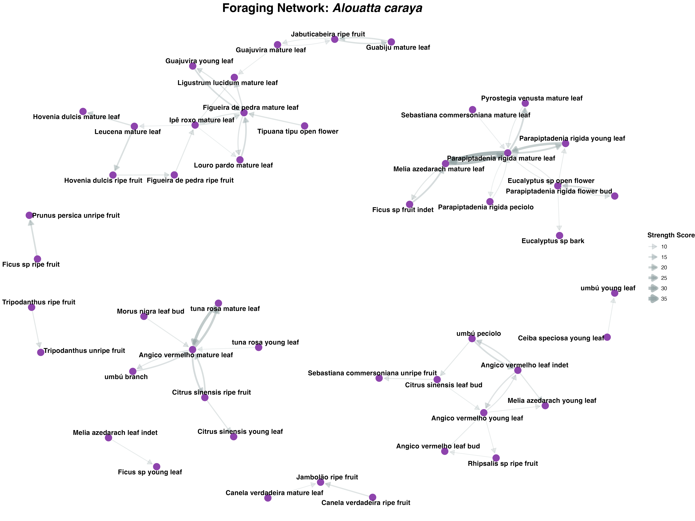

# HEALouatta: A Dual-Framework Foraging Analysis Suite

**HEALouatta** is a specialized R ecosystem designed for behavioral ecologists studying *Alouatta* (Howler monkey) foraging scans. It provides a modular pipeline to process raw field data and a high-end interactive engine to explore non-random dietary patterns.

This suite implements the "Dual-Method" approach popularized by **Freymann et al. (2024)**, allowing researchers to investigate both sequential transitions and daily co-occurrences.

The APRIORI web-app is available at [osteomics: HEALouatta](https://osteomics.com/HEALouatta).

---

# 🔬 Analytical Frameworks

The core of the project is split into two complementary analytical paths:

### 1. The Sequential Pipeline (MDCA)

Executed via `run_analysis.R`, this pipeline treats foraging as a directional "chain" of events.
* **Methodology**: Multidimensional Collocation Analysis (MDCA).
* **Logic**: A transition is identified when an actor moves from Item A to Item B within a 60-minute window on the same day.
* **Stats**: Uses an Exact Binomial Test to calculate *Collocation Strength*.
* **Use Case**: Identifying specific "dietary recipes" where one food item acts as a lead-in to another.

### 2. The Discovery Engine (APRIORI App)

Launched via the `/app/` directory, this tool treats foraging as a "market basket".
* **Methodology**: Association Rule Mining (APRIORI).
* **Logic**: Ignores the order of consumption to look at the "Daily Intake". If Item A and Item B are eaten by the same individual on the same day, they are co-occurring.
* **Stats**: Uses $Support$, $Confidence$, and $Lift$ to find potential medicinal bundles.
* **Use Case**: Detecting self-medication where the "dose" is spread across different hours of the day.

---
  
# ✨ Key Features
  
### Automated Data Repair

Fixes common Excel and manual-entry issues:
- Excel serial dates, 6- or 8-digit date strings, and fractional time formats.
- Remove data entries without full species of item eaten.
- Manual entry "Typo Gate" (e.g., `9000 → 0900`).

### Bout Identification

To transform discrete foraging scans into continuous feeding events, the pipeline implements a three-tier grouping logic:

- **Actor Identity:** Scans are grouped by individual to ensure that transitions reflect the dietary choices of a single organism.
- **Item Continuity:** A new bout is triggered if the food item or plant part changes (e.g., moving from Ficus fruit to Ficus leaves).
- **The 60-Minute Rule:** To maintain independence between events, a time gap of >60 minutes between scans of the same item by the same actor will terminate the current bout and start a new one.

**Why this matters:** This prevents "over-counting" transitions. For example, if a monkey eats the same fruit for three consecutive scans, the pipeline treats this as one single bout rather than two transitions, ensuring your Collocation Strength is not artificially inflated.

### Visualization

Automatically generates high-resolution bar charts and directional network graphs for the MDCA pipeline.

### 1. Bar charts for species or populations

Fig. 1 - Bar chart of 32 top transitions at species level, here exemplified with *A. guariba*

### 2. Network graph for species or populations

Fig. 2 - Network of 64 top transitions at species level, here exemplified with *A. caraya*

---
  
# 📂 Project Structure
  
Only the master script resides in the root directory. All logic is encapsulated inside the `R/` and `app/` folders.

```
├── app/                 # Interactive Discovery Engine (APRIORI)
│   ├── ui.R             # Responsive UI with Bugio branding
│   ├── server.R         # APRIORI logic engine
│   ├── helpers.R        # Basket transformation logic
│   ├── setSliderColor.R # Dynamic CSS for beautiful sliders
│   └── www/             # Logos, style.css, and katex-init.js
├── data_checkpoints/
├── outputs/             # Bout-processed tables
├── R/                   # Modular MDCA pipeline logic
│   ├── clean_data.R     
│   ├── main_bouts.R     
│   ├── run_collocation_MDCA.R 
│   ├── run_collocation_plots.R 
│   └── viz_data_plots.R     
├── results/             # Saved BarCharts and NetworkPlots
├── alouatta_data.xlsx   # (Private Research Data; not available for github)
├── Alouatta_medicine.Rproj
└── run_analysis.R       # Master controller for MDCA
```

---
  
# 📊 Logic & Statistics
  
### Collocation Strength (Sequential)

The pipeline applies a statistical framework to determine whether certain food items are eaten sequentially more often than expected by chance. Transition strength is calculated using the **Exact Binomial Test**:

$$Strength\ Score = -\log_{10}(p\text{-value})$$

where:

- the $p$-value is the probability of observing $k$ or more transitions  
- given the global frequency of the second food item ($P$) and the total number of bouts ($n$).

Higher values indicate stronger-than-chance dietary sequencing.


### Association Rules (Non-Sequential)

The Discovery Engine uses the **APRIORI algorithm** to identify "Daily Baskets". This identifies items eaten on the same day by the same actor, regardless of order, providing insights into synergistic medicinal effects.

The engine evaluates these associations using three primary metrics:

- **Support:** The proportion of total foraging days (transactions) that contain both Item A and Item B. It indicates how frequently the combination occurs in the population.

$$Support(A \rightarrow B) = P(A \cap B)$$

- **Confidence:** The probability that Item B is consumed given that Item A was consumed on the same day. It measures the reliability of the association.

$$Confidence(A \rightarrow B) = \frac{P(A \cap B)}{P(A)}$$

- **Lift:** The ratio of the observed support to the support expected if A and B were independent. A Lift > 1 indicates that the items occur together more often than by chance, suggesting a non-random biological "bundle."

$$Lift(A \rightarrow B) = \frac{P(A \cap B)}{P(A) \times P(B)}$$

---
  
# 🚀 Usage

## 1. Run the Sequential Pipeline (MDCA)

Open \run_analysis.R\ in R and set the \RUN_SCOPE\ variable.

You can filter by:
  
- \"ALL"\ (this gives you full analysis of the entire dataset)
- species name (e.g., "Alouatta caraya", "Alouatta guariba")
- population code (e.g., "NSG", "JCBM")

## 2. Launch the HEALouatta App (APRIORI)
To explore daily co-occurrence associations through the interactive browser:

```
shiny::runApp('app')
```

---
  
# 🛠️ Requirements

Built on R version 4.5.2 (2025-10-31).

| Category | Packages |
|---------|---------|
| Data Manipulation | [data.table](https://cran.r-project.org/package=data.table), [readxl](https://cran.r-project.org/package=readxl) |
| Statistics | [data.table](https://cran.r-project.org/package=data.table), [arules](https://cran.r-project.org/package=arules) |
| Visualization | [ggplot2](https://cran.r-project.org/package=ggplot2), [viridis](https://cran.r-project.org/package=viridis), [ggtext](https://cran.r-project.org/package=ggtext), [igraph](https://cran.r-project.org/package=igraph), [ggraph](https://cran.r-project.org/package=ggraph), [visNetwork](https://cran.r-project.org/package=visNetwork) |
| File I/O | [openxlsx](https://cran.r-project.org/package=openxlsx) |
| App Interface | [shiny](https://cran.r-project.org/package=shiny), [shinythemes](https://cran.r-project.org/package=shinythemes) |

You can install all required packages by running:

```r
install.packages(c(
  "data.table", "readxl", "openxlsx", "DT", "magrittr"
  "ggplot2", "ggtext", "ggraph", "igraph", "viridis",
  "arules", "arulesViz", "shiny", "shinythemes", "visNetwork"
))
```

---

## 📚 References

### Primary Methodology

Freymann, E., d’Oliveira Coelho, J., Hobaiter, C., Huffman, M. A., Muhumuza, G., Zuberbühler, K., & Carvalho, S. (2024). Applying collocation and APRIORI analyses to chimpanzee diets: Methods for investigating nonrandom food combinations in primate self-medication. *American Journal of Primatology*, 86(5), e23603.

### Statistical Framework (MDCA & Collostructions)

Gries, S. Th. (2013). 50-something years of work on collocations: What is or should be next… *International Journal of Corpus Linguistics*, 18(1), 137–165.

Stefanowitsch, A., & Gries, S. Th. (2003). Collostructions: Investigating the interaction of words and constructions *International Journal of Corpus Linguistics*, 8(2), 209–243.

### Association Rules (APRIORI App)

Agrawal, R., Srikant, R. (1994). Fast algorithms for mining association rules in large databases, *Proceedings of the 20th International Conference on Very Large Data Bases* (pp. 487–499). Morgan Kaufmann Publishers Inc.

Al-Maolegi, M., & Arkok, B. (2014). An improved Apriori algorithm for association rules. *ArXiv Preprint* ArXiv:1403.3948.

Hahsler, M. (2017). arulesViz: Interactive Visualization of Association Rules with R. *The R Journal* 9, 163-175.

Hahsler, M., Chelluboina, S., Hornik, K., Buchta, C. (2011). The arules R-Package Ecosystem: analyzing interesting patterns from large transaction data sets. *Journal of Machine Learning Research* 12, 2021–2025.

Hahsler, M., Karpienko, R. (2017). Visualizing association rules in hierarchical groups. *Journal of Business Economics* 87, 317-335.

Hornik, K., Grün, B., Hahsler, M. (2005). arules-A computational environment for mining association rules and frequent item sets. *Journal of Statistical Software* 14(15), 1–25.